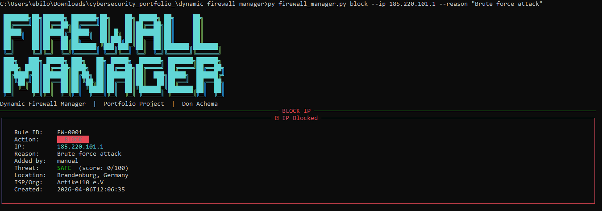
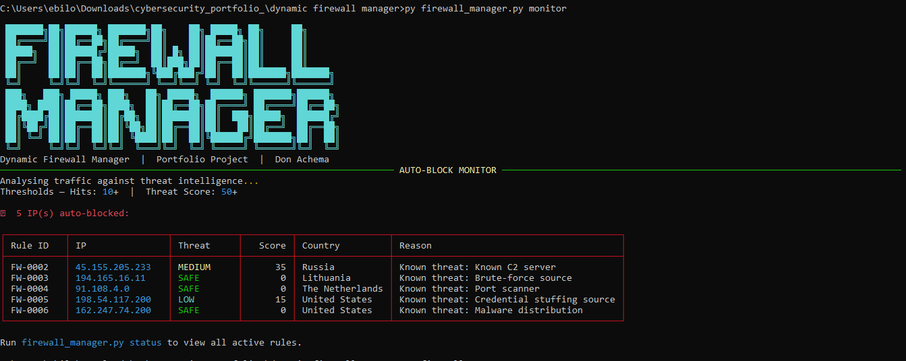
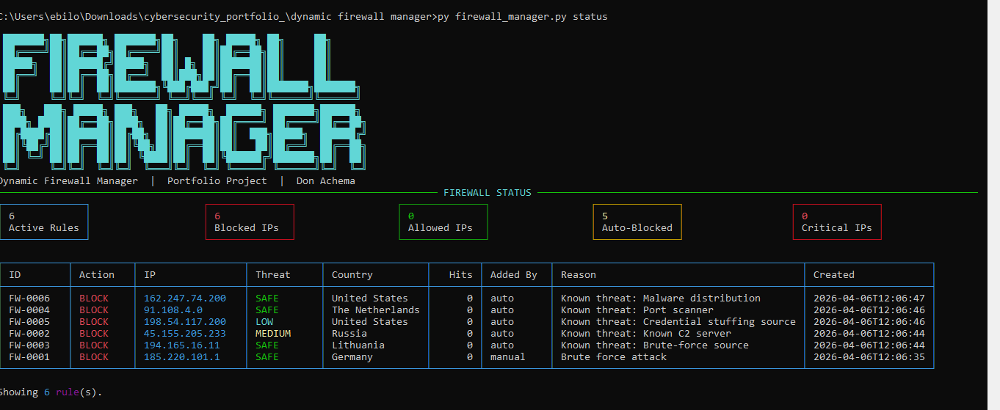

<h1 align="center">
  🔥 Dynamic Firewall Manager
</h1>

<p align="center">
  <b>Block, allow, monitor and auto-block IPs with threat intelligence.</b>
</p>

<p align="center">
  
  
  
  
</p>

---

## 📸 Screenshots

### 1. Blocking an IP


### 2. Auto-block monitor


### 3. Firewall status dashboard


---

## 🧠 What It Does

| Command | Description |
|---|---|
| `block` | Manually block an IP address or CIDR range |
| `allow` | Whitelist a trusted IP address |
| `remove` | Remove an active rule by ID |
| `status` | View all active rules with threat scores and geo data |
| `monitor` | Auto-block IPs based on hit count and threat score |
| `log` | View the activity log |

---

## 🏗️ Architecture

```
dynamic_firewall_manager/
├── firewall_manager.py  ← CLI entry point (Rich interface)
├── rule_engine.py       ← Rule storage, auto-block engine
├── ip_utils.py          ← IP validation, geolocation, threat scoring
└── requirements.txt
```

### Rule Storage
Rules are saved to `rules.json` — persistent across sessions.

### Threat Scoring (0–100)

| Factor | Points |
|---|---|
| Hit count (100+) | +30 |
| High-risk country | +20 |
| Suspicious ISP/org (VPN, hosting, Tor) | +15 |
| Threat labels | CRITICAL / HIGH / MEDIUM / LOW / SAFE |

### Auto-block Thresholds (configurable)

| Trigger | Default |
|---|---|
| Hits per IP | 10+ |
| Threat score | 50+ |
| Known threat feed match | Always |

---

## ⚙️ Setup

```cmd
cd dynamic_firewall_manager
pip install -r requirements.txt
```

---

## 🚀 Usage

### Block an IP
```cmd
python firewall_manager.py block --ip 185.220.101.1 --reason "Brute force attack"
```

### Allow a trusted IP
```cmd
python firewall_manager.py allow --ip 10.0.0.5 --reason "Internal server"
```

### View all active rules
```cmd
python firewall_manager.py status
```

### View only blocked IPs
```cmd
python firewall_manager.py status --blocked
```

### Remove a rule
```cmd
python firewall_manager.py remove --id FW-0001
```

### Auto-block monitor (demo mode)
```cmd
python firewall_manager.py monitor
```

### Custom thresholds
```cmd
python firewall_manager.py monitor --hits 5 --score 40
```

### View activity log
```cmd
python firewall_manager.py log
```

---

## 🔐 Security Design

- **Rules persist** in `rules.json` — survive restarts
- **k-safe geolocation** — uses ip-api.com free tier (no API key)
- **Threat scoring** considers hit count, country risk, and ISP type
- **Duplicate rule prevention** — won't create two active rules for the same IP
- **Activity logging** — every action is timestamped in `activity.log`

---

## 🛠️ Skills Demonstrated

- **JSON-based persistence** (rule storage)
- **IP address validation** with `ipaddress` module
- **REST API** consumption (geolocation)
- **Threat intelligence** scoring engine
- **Rich** terminal UI — colour-coded panels, tables, stat cards
- **Argparse** multi-command CLI design
- **CIDR range** support

---

## 👨‍💻 Author

**Don Achema** — [@Don-cybertech](https://github.com/Don-cybertech)  
Cybersecurity Student | Python Security Tools Portfolio
